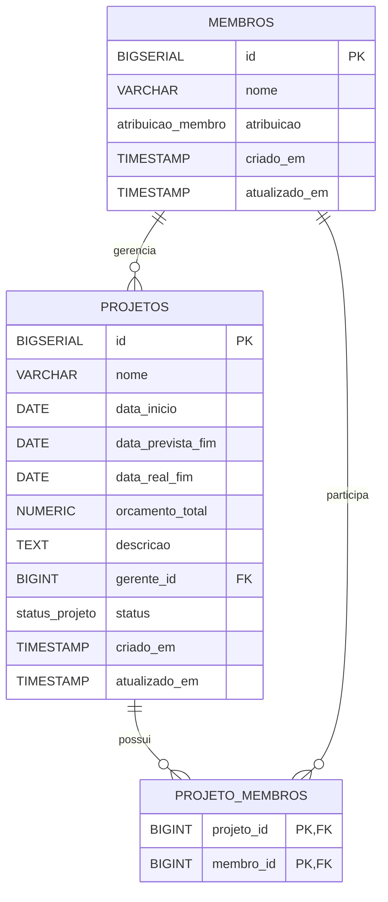

# Portfolio Gerenciamento Service

API REST para gerenciamento de portfolio de projetos. A aplicacao cobre cadastro de membros, ciclo de vida de projetos, alocacao de membros, classificacao dinamica de risco, filtros paginados e relatorio consolidado.

## Sumario

- [Tecnologias](#tecnologias)
- [Arquitetura](#arquitetura)
- [Regras de negocio](#regras-de-negocio)
- [Seguranca](#seguranca)
- [Banco de dados](#banco-de-dados)
- [Execucao](#execucao)
- [Testes](#testes)
- [Variaveis de ambiente](#variaveis-de-ambiente)
- [Endpoints](#endpoints)
- [Exemplos](#exemplos)
- [Diagramas](#diagramas)
- [Melhorias futuras](#melhorias-futuras)

## Tecnologias

As versoes principais estao declaradas no `pom.xml` ou gerenciadas pelo BOM do Spring Boot.

| Tecnologia | Versao/configuracao | Uso |
|---|---:|---|
| Java | 21 | Runtime da aplicacao |
| Spring Boot | 4.0.6 | Base da aplicacao e gerenciamento de dependencias |
| Spring Web MVC | gerenciado pelo Spring Boot | Controllers REST |
| Spring Data JPA | gerenciado pelo Spring Boot | Repositories e Specifications |
| Spring Security | gerenciado pelo Spring Boot | Basic Auth stateless |
| PostgreSQL JDBC | gerenciado pelo Spring Boot | Driver do banco |
| PostgreSQL | 16-alpine | Banco local via Docker Compose e banco dos testes de integracao |
| Flyway | gerenciado pelo Spring Boot | Migracao do schema |
| MapStruct | 1.5.5.Final | Conversao entre DTOs e entidades |
| Lombok | 1.18.38 | Reducao de boilerplate |
| Testcontainers | 1.21.4 | PostgreSQL real nos testes de integracao |
| Spring Boot Docker Compose | gerenciado pelo Spring Boot | Inicializacao automatica dos servicos locais definidos em `docker-compose.yml` |
| Springdoc OpenAPI | 3.0.2 | Swagger UI e OpenAPI |
| Micrometer Prometheus | 1.16.4 | Metricas Prometheus via actuator |
| JaCoCo | 0.8.13 | Relatorio e gate de cobertura |
| Maven Wrapper | Maven 3.9.14 | Build padronizado |

## Arquitetura

O projeto usa uma arquitetura em camadas:

| Pacote | Responsabilidade |
|---|---|
| `controllers` | Endpoints REST, status HTTP, Swagger e validacao de entrada com `@Valid`. |
| `services` | Casos de uso, transacoes, repositories, validators e mappers. |
| `services.validator` | Regras de datas, gerente, status, exclusao e alocacao. |
| `services.classificacaorisco` | Regras de classificacao dinamica de risco. |
| `services.report` | Resumo consolidado do portfolio. |
| `repositories` | Spring Data JPA e queries JPQL especificas. |
| `specification` | Filtros dinamicos da listagem de projetos. |
| `entities` | Entidades JPA persistidas no PostgreSQL. |
| `dtos.request` | Contratos de entrada. |
| `dtos.response` | Contratos de saida. |
| `mappers` | Conversao MapStruct. |
| `exceptions` e `exceptions.handler` | Excecoes de dominio e resposta padronizada de erro. |
| `configs.security` | Basic Auth, CORS, CSRF desabilitado e sessao stateless. |
| `configs.openapi` | Configuracao OpenAPI. |
| `configs.properties` | Bind de propriedades externas. |

Fluxo basico:

1. Cliente chama um endpoint REST.
2. `SecurityConfig` autentica a requisicao, exceto rotas publicas.
3. Controller valida o DTO e delega ao service.
4. Service aplica regras de negocio e persiste/consulta via repository.
5. Mapper converte entidades para DTOs de resposta.
6. `GlobalExceptionHandler` padroniza erros.

## Regras de negocio

### Membros

- A API de membros simula uma API externa interna ao projeto.
- Atribuicoes aceitas: `FUNCIONARIO`, `GERENTE`, `DIRETOR`, `TERCEIRIZADO`.
- `nome` e `atribuicao` sao obrigatorios.
- Apenas membros com atribuicao `FUNCIONARIO` podem ser associados a projetos.
- Apenas membros com atribuicao `GERENTE` podem ser gerente de projeto.

### Projetos

Para criar ou atualizar um projeto, o payload exige:

- `nome`
- `dataInicio`
- `dataPrevistaFim`
- `orcamentoTotal`
- `gerenteId`
- `status` somente na criacao

Regras aplicadas:

- `gerenteId` deve existir e apontar para um membro com atribuicao `GERENTE`.
- `orcamentoTotal` deve ser maior ou igual a zero.
- `dataPrevistaFim` nao pode ser anterior a `dataInicio`.
- `dataRealFim`, quando informada, nao pode ser anterior a `dataInicio`.
- A classificacao de risco nao e persistida; ela e calculada dinamicamente na resposta.
- Na criacao, o status informado e aceito desde que seja um valor valido do enum `ProjetoStatus`.

### Status

Fluxo normal:

```text
EM_ANALISE -> ANALISE_REALIZADA -> ANALISE_APROVADA -> INICIADO -> EM_ANDAMENTO -> ENCERRADO
```

Regras:

- `CANCELADO` e permitido a partir de qualquer status.
- Transicao para o mesmo status e aceita sem erro.
- Pular etapas do fluxo normal e bloqueado.
- Ao alterar o status para `ENCERRADO` ou `CANCELADO`, a aplicacao preenche `dataRealFim` com `LocalDate.now()` quando a regra permite.
- `ENCERRADO` e `CANCELADO` sao considerados status inativos para a contagem de alocacoes ativas.

### Exclusao

Projetos nao podem ser excluidos quando estiverem em:

- `INICIADO`
- `EM_ANDAMENTO`
- `ENCERRADO`

Nos demais status, a exclusao e permitida.

### Alocacao de membros

Para associar um membro a um projeto:

- O membro deve existir.
- O projeto deve existir.
- O membro deve ter atribuicao `FUNCIONARIO`.
- O membro nao pode estar associado ao mesmo projeto.
- O projeto nao pode ultrapassar `portfolio.projeto.max-membros`.
- O membro nao pode ultrapassar `portfolio.projeto.max-alocacoes-ativas` em projetos que nao estejam em `ENCERRADO` ou `CANCELADO`.

Para remover um membro:

- O membro deve estar associado ao projeto.
- O projeto deve manter pelo menos um membro apos a remocao.

### Classificacao de risco

A classificacao e calculada em memoria por regras implementadas pela sealed interface `RegraClassificacaoRisco`.

Ordem de avaliacao:

1. `ALTO`: orcamento maior que `portfolio.projeto.limite-orcamento-alto` ou duracao maior que 6 meses.
2. `MEDIO`: orcamento maior que `portfolio.projeto.limite-orcamento-baixo` ou duracao maior que 3 meses.
3. `BAIXO`: nenhuma regra superior foi atendida.

Valores padrao:

- `portfolio.projeto.max-membros=10`
- `portfolio.projeto.max-alocacoes-ativas=3`
- `portfolio.projeto.limite-orcamento-baixo=100000.00`
- `portfolio.projeto.limite-orcamento-alto=500000.00`

### Relatorio consolidado

`GET /api/v1/relatorios/resumo-portfolio` retorna:

- contagem de projetos por status
- soma do orcamento por status
- media de duracao, em dias, dos projetos `ENCERRADO` com `dataRealFim`
- total de membros distintos alocados em pelo menos um projeto

## Seguranca

A API usa Basic Auth com usuario em memoria.

Configuracao atual:

- Senha codificada com `BCryptPasswordEncoder`.
- Sessao stateless (`SessionCreationPolicy.STATELESS`).
- CSRF desabilitado.
- CORS configurado por `portfolio.cors.allowed-origins`.
- Role criada para o usuario em memoria: `ADMIN`.

Credenciais padrao:

```text
admin / admin123
```

Rotas publicas:

- `/swagger-ui/**`
- `/v3/api-docs/**`
- `/actuator/health`
- `OPTIONS /**`

Todas as demais rotas exigem autenticacao.

## Banco de dados

O banco e PostgreSQL. O schema e criado por Flyway em:

```text
src/main/resources/db/migration/V1__create_initial_schema.sql
```

Configuracao:

- `spring.jpa.hibernate.ddl-auto=validate`
- `spring.flyway.enabled=true`
- Hibernate valida o schema, mas nao cria nem altera tabelas.

Tabelas:

- `membros`
- `projetos`
- `projeto_membros`

Tipos PostgreSQL customizados:

- `atribuicao_membro`
- `status_projeto`

Indices:

- `idx_projetos_status`
- `idx_projetos_gerente_id`
- `idx_projetos_data_inicio`
- `idx_projetos_data_prevista_fim`
- `idx_projeto_membros_membro_id`

Diagrama ER:



## Execucao

Pre-requisitos:

- Java 21
- Docker e Docker Compose em execucao
- Maven Wrapper incluido no repositorio

Verificar Maven Wrapper:

```bash
./mvnw -version
```

No Windows:

```powershell
.\mvnw.cmd -version
```

Rodar aplicacao:

```bash
./mvnw spring-boot:run
```

No Windows:

```powershell
.\mvnw.cmd spring-boot:run
```

Com a dependencia `spring-boot-docker-compose`, o Spring Boot detecta o arquivo `docker-compose.yml` e inicializa automaticamente os servicos locais durante o start da aplicacao. Portanto, para o fluxo padrao de desenvolvimento, nao e necessario executar `docker compose up -d` antes de iniciar a API.

Servicos inicializados pelo Docker Compose:

- PostgreSQL: `localhost:5432`
- pgAdmin: `http://localhost:5050`

URLs da aplicacao:

- API: `http://localhost:8080`
- Swagger UI: `http://localhost:8080/swagger-ui/index.html`
- OpenAPI JSON: `http://localhost:8080/v3/api-docs`
- Health: `http://localhost:8080/actuator/health`

### Gerenciamento manual do Docker Compose

O gerenciamento manual continua disponivel para cenarios em que voce queira subir ou parar os servicos sem iniciar a aplicacao.

Subir PostgreSQL e pgAdmin manualmente:

```bash
docker compose up -d
```

Parar servicos:

```bash
docker compose down
```

Parar servicos e remover volume:

```bash
docker compose down -v
```

Se precisar iniciar a aplicacao sem que o Spring Boot gerencie o Compose, desabilite o suporte com `SPRING_DOCKER_COMPOSE_ENABLED=false`.

## Testes

A suite usa JUnit 5/JUnit Platform, Mockito, MockMvc, Testcontainers, PostgreSQL real e Flyway.

Comandos:

```bash
./mvnw test
./mvnw clean verify
```

No Windows:

```powershell
.\mvnw.cmd test
.\mvnw.cmd clean verify
```

Observacoes:

- O profile `test` define `spring.docker.compose.enabled=false`, pois os testes de integracao usam Testcontainers para provisionar o PostgreSQL isolado da aplicacao local.
- `BaseIntegrationTest` usa `@Testcontainers(disabledWithoutDocker = true)`.
- Se Docker nao estiver disponivel, os testes de integracao sao ignorados.
- Em ambiente Windows com Docker instalado no WSL, execute os testes dentro do WSL para que o Testcontainers acesse `/var/run/docker.sock`.
- O JaCoCo roda no ciclo Maven e o gate atual exige no minimo 70% de linhas e 70% de branches para pacotes `com.portfolio.gerenciamento.services*`.

Relatorio JaCoCo:

```text
target/site/jacoco/index.html
```

## Variaveis de ambiente

### Aplicacao

| Variavel | Padrao | Descricao |
|---|---|---|
| `ACTIVE_PROFILE` | `dev` | Profile padrao. |
| `SERVER_PORT` | `8080` | Porta HTTP. |
| `CORS_ALLOWED_ORIGINS` | `http://localhost:5173` | Origens permitidas no CORS. |
| `SPRING_DOCKER_COMPOSE_ENABLED` | `true` | Habilita o suporte do Spring Boot ao Docker Compose. No profile `test`, o projeto define `false`. |

### Banco

| Variavel | Padrao | Descricao |
|---|---|---|
| `DATABASE_URL` | `jdbc:postgresql://localhost:5432/portfolio_dev` | JDBC URL. |
| `DATABASE_USERNAME` | `user` | Usuario do banco. |
| `DATABASE_PASSWORD` | `password` | Senha do banco. |

### Seguranca

| Variavel | Padrao | Descricao |
|---|---|---|
| `SECURITY_USER` | `admin` | Usuario Basic Auth. |
| `SECURITY_PASSWORD` | `admin123` | Senha Basic Auth. |

### Regras de projeto

| Variavel | Padrao | Descricao |
|---|---:|---|
| `MAX_MEMBROS_PROJETO` | `10` | Maximo de membros por projeto. |
| `MAX_ALOCACOES_ATIVAS` | `3` | Maximo de projetos ativos por membro. |
| `LIMITE_ORCAMENTO_BAIXO` | `100000.00` | Limite para risco medio. |
| `LIMITE_ORCAMENTO_ALTO` | `500000.00` | Limite para risco alto. |

### Docker Compose

| Variavel | Padrao | Descricao |
|---|---|---|
| `POSTGRES_CONTAINER_NAME` | `portfolio-postgres-dev` | Nome do container PostgreSQL. |
| `POSTGRES_DB` | `portfolio_dev` | Banco criado no container. |
| `POSTGRES_USER` | `user` | Usuario PostgreSQL. |
| `POSTGRES_PASSWORD` | `password` | Senha PostgreSQL. |
| `POSTGRES_PORT` | `5432` | Porta publicada no host. |
| `POSTGRES_VOLUME_NAME` | `portfolio_data` | Nome do volume Docker. |
| `PGADMIN_CONTAINER_NAME` | `portfolio-pgadmin-dev` | Nome do container pgAdmin. |
| `PGADMIN_DEFAULT_EMAIL` | `admin@portfolio.com` | Email do pgAdmin. |
| `PGADMIN_DEFAULT_PASSWORD` | `admin` | Senha do pgAdmin. |
| `PGADMIN_PORT` | `5050` | Porta publicada do pgAdmin. |

## Endpoints

### Membros

| Metodo | Rota | Descricao |
|---|---|---|
| `POST` | `/api/v1/membros` | Cria membro. |
| `GET` | `/api/v1/membros/{id}` | Busca membro por id. |
| `GET` | `/api/v1/membros` | Lista membros. |

### Projetos

| Metodo | Rota | Descricao |
|---|---|---|
| `POST` | `/api/v1/projetos` | Cria projeto. |
| `GET` | `/api/v1/projetos/{id}` | Busca projeto por id. |
| `GET` | `/api/v1/projetos` | Lista projetos com filtros opcionais e paginacao. |
| `PUT` | `/api/v1/projetos/{id}` | Atualiza dados do projeto, exceto status e membros. |
| `PATCH` | `/api/v1/projetos/{id}/status` | Atualiza status. |
| `DELETE` | `/api/v1/projetos/{id}` | Exclui projeto quando permitido. |
| `POST` | `/api/v1/projetos/{projetoId}/membros/{membroId}` | Associa membro ao projeto. |
| `DELETE` | `/api/v1/projetos/{projetoId}/membros/{membroId}` | Remove membro do projeto. |

Filtros de `GET /api/v1/projetos`:

- `nome`
- `status`
- `gerenteId`
- `dataInicio`
- `dataFimPrevista`
- `classificacaoRisco`
- parametros de paginacao do Spring Data, como `page`, `size` e `sort`

### Relatorios

| Metodo | Rota | Descricao |
|---|---|---|
| `GET` | `/api/v1/relatorios/resumo-portfolio` | Retorna resumo consolidado. |

### Formato de erro

Erros retornam `ErrorResponse`:

```json
{
  "timestamp": "2026-05-04T10:15:30",
  "status": 400,
  "erro": "Bad Request",
  "mensagem": "Falha na valida\u00e7\u00e3o",
  "caminho": "/api/v1/projetos",
  "campoErros": {
    "nome": "n\u00e3o deve estar em branco"
  }
}
```

## Exemplos

Os exemplos assumem:

```text
baseUrl = http://localhost:8080
Basic Auth = admin:admin123
```

Criar membro gerente:

```bash
curl -u admin:admin123 \
  -H "Content-Type: application/json" \
  -X POST http://localhost:8080/api/v1/membros \
  -d '{
    "nome": "Ana Silva",
    "atribuicao": "GERENTE"
  }'
```

Criar membro funcionario:

```bash
curl -u admin:admin123 \
  -H "Content-Type: application/json" \
  -X POST http://localhost:8080/api/v1/membros \
  -d '{
    "nome": "Carla Souza",
    "atribuicao": "FUNCIONARIO"
  }'
```

Criar projeto:

```bash
curl -u admin:admin123 \
  -H "Content-Type: application/json" \
  -X POST http://localhost:8080/api/v1/projetos \
  -d '{
    "nome": "Atualizacao ERP",
    "dataInicio": "2026-05-01",
    "dataPrevistaFim": "2026-09-01",
    "dataRealFim": null,
    "orcamentoTotal": 250000.00,
    "descricao": "Modernizacao do modulo financeiro do ERP.",
    "gerenteId": 1,
    "status": "EM_ANALISE"
  }'
```

Listar projetos com filtros:

```bash
curl -u admin:admin123 \
  "http://localhost:8080/api/v1/projetos?nome=ERP&status=EM_ANALISE&gerenteId=1&dataInicio=2026-05-01&dataFimPrevista=2026-09-01&classificacaoRisco=MEDIO&page=0&size=10"
```

Atualizar status:

```bash
curl -u admin:admin123 \
  -H "Content-Type: application/json" \
  -X PATCH http://localhost:8080/api/v1/projetos/1/status \
  -d '{
    "status": "ANALISE_REALIZADA"
  }'
```

Associar funcionario ao projeto:

```bash
curl -u admin:admin123 \
  -X POST http://localhost:8080/api/v1/projetos/1/membros/2
```

Remover membro do projeto:

```bash
curl -u admin:admin123 \
  -X DELETE http://localhost:8080/api/v1/projetos/1/membros/2
```

Gerar relatorio:

```bash
curl -u admin:admin123 \
  http://localhost:8080/api/v1/relatorios/resumo-portfolio
```

## Melhorias futuras

- OAuth2/OIDC com JWT em vez de Basic Auth.
- Auditoria com usuario responsavel por alteracoes.
- Observabilidade com tracing distribuido.
- Pipeline CI/CD com Testcontainers.
- Frontend administrativo consumindo OpenAPI.
- Paginacao e filtros para membros.
- Autorizacao por endpoint alem da autenticacao atual.
